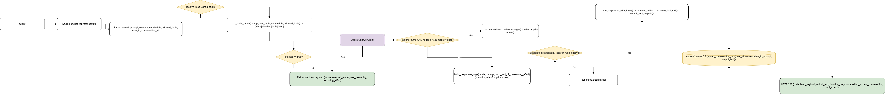
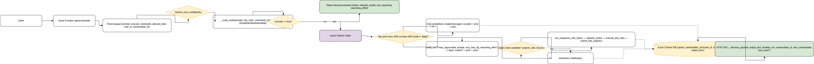

# Azure Functions

## Diagrammes et Flows

Voici quelques diagrammes pour illustrer l'architecture et les flux principaux du projet :







## Chat using Azure OpenAI (Python v2 Function) + MCP Orchestration

This project demonstrates how to build a Python Azure Functions app that interacts with Azure OpenAI and orchestrates tools via the Model Context Protocol (MCP). It includes a simple `/api/ask` endpoint, several `/api/mcp-*` endpoints for tool execution, and optional chat endpoints backed by assistant bindings.

## Run on your local environment

### Pre-requisites
1. [Python 3.8+](https://www.python.org/)
2. [Azure Functions Core Tools 4.0.6610 or higher](https://learn.microsoft.com/en-us/azure/azure-functions/functions-run-local?tabs=v4%2Cmacos%2Ccsharp%2Cportal%2Cbash#install-the-azure-functions-core-tools)
3. [Azurite](https://github.com/Azure/Azurite) for local storage emulation

The easiest way to install Azurite is using a Docker container:

```bash
docker run -d -p 10000:10000 -p 10001:10001 -p 10002:10002 mcr.microsoft.com/azure-storage/azurite
```

### Provision Azure resources

```bash
azd provision
```

This creates the Azure resources including an Azure OpenAI instance.  The `AZURE_OPENAI_ENDPOINT` and `AZURE_OPENAI_KEY` values can be found in `./.azure/<env-name>/.env`.

### Local settings

Create a `local.settings.json` file in the repository root.  Replace `AZURE_OPENAI_ENDPOINT` and `AZURE_OPENAI_KEY` with your values.

```json
{
  "IsEncrypted": false,
  "Values": {
    "AzureWebJobsStorage": "UseDevelopmentStorage=true",
    "FUNCTIONS_WORKER_RUNTIME": "python",
    "AZURE_OPENAI_ENDPOINT": "https://cog-<unique>.openai.azure.com/",
    "AZURE_OPENAI_KEY": "<your-key>",
    "CHAT_MODEL_DEPLOYMENT_NAME": "chat",
    "AzureWebJobsFeatureFlags": "EnableWorkerIndexing",
    "PYTHON_ISOLATE_WORKER_DEPENDENCIES": "1"
  }
}
```

### MCP configuration

If you plan to use the MCP endpoints, configure these additional environment variables (they can be added under `Values` in `local.settings.json`):

- `TOOLS_SSE_URL`: SSE endpoint of the MCP Function server.  If not set the service will also check `LOCAL_MCP_SSE_URL` or `MCP_SSE_URL`.
- `TOOLS_FUNCTIONS_KEY`: Optional Functions key used as `x-functions-key`.  Also checked: `LOCAL_MCP_FUNCTIONS_KEY` or `MCP_SSE_KEY`.
- `ALLOW_CLIENT_MCP_OVERRIDE`: Set to `true` to allow callers to override `mcp_url` and headers per request.
- `AZURE_OPENAI_MODEL`: Default model to use for `mcp-*` endpoints.
- `DEFAULT_REASONING_EFFORT`: One of `low`, `medium`, or `high`.
- `ALLOWED_CORS_ORIGINS`: Comma-separated list of allowed origins for MCP HTTP endpoints.
- `AZURE_OPENAI_API_VERSION`: Defaults to `2025-01-01-preview`. Ensure your Azure OpenAI resource supports this version.
- Storage settings: `MCP_JOBS_QUEUE` (default `mcpjobs`) and `MCP_JOBS_CONTAINER` (default `jobs`).

### Start the app

```bash
pip install -r requirements.txt
func start
```

See [`test.http`](test.http) for ready-to-run examples.

## Available endpoints

- `GET /api/ping` – health check.
- `POST /api/ask` – send a prompt and receive a completion. Supports optional `user_id` and `conversation_id` for memory.
- MCP endpoints:
  - `POST /api/mcp-run` – run a prompt with optional tools.
  - `POST /api/mcp-enqueue` – enqueue a prompt for background processing.
  - `POST /api/mcp-process` – process a queued job (useful when running locally without a queue trigger).
  - `GET /api/mcp-result?job_id=<id>` – poll the status or result of a queued job.
  - `GET /api/mcp-memories` and `GET /api/mcp-memory` – query stored memories.

Optional chat endpoints (`PUT|GET|POST /api/chats/{chatId}`) are enabled when the `ENABLE_ASSISTANT_BINDINGS` environment variable is set.

## Classic function tools (Websearch + Document Service)

This app can attach classic function tools to the model (Responses API) so it can automatically call them during reasoning.

### Websearch tool

Configure these variables to enable the websearch tool:

- `ENABLE_WEBSEARCH_TOOL`: `true|false` (default: `true`)
- `WEBSEARCH_FUNCTION_URL`: The full URL of the websearch Function endpoint (e.g., `https://<func>.azurewebsites.net/api/websearch` or local)
- `WEBSEARCH_FUNCTION_KEY`: Optional Functions key. If provided and not embedded in the URL, it will be appended as `?code=<key>`

Usage: when enabled, the tool `search_web` is available and can be used automatically with `tool_choice=auto`.

### Document Service tools

If you run a companion Document Service exposing endpoints like `http://localhost:7075/api/...`, enable the following variables:

- `ENABLE_DOCSVC_TOOLS`: `true|false` (default: `true`)
- `DOCSVC_BASE_URL`: Base URL for the service, e.g., `http://localhost:7075/api`
- `DOCSVC_FUNCTION_KEY`: Optional Functions key; appended as `?code=<key>` if present

Available tools:

- `convert_word_to_pdf(source_url, file_name?)` → POST `/convert/word-to-pdf`
- `init_user(user_id)` → POST `/users/{userId}/init`
- `list_images(user_id)` → GET `/users/{userId}/images`
- `list_shared_templates()` → GET `/templates`
- `list_templates_http(user_id)` → GET `/users/{userId}/templates`

When classic tools are enabled, they are added under `tools` and `tool_choice` is set to `auto` for endpoints that support tool use (e.g., `/api/orchestrate`, `/api/ask`, `/api/mcp-run`). You can restrict tool usage by specifying `allowed_tools` in the request body (e.g., `"allowed_tools": ["convert_word_to_pdf"]`).

## Using model-router and gpt-oss-120b

The project supports two special model aliases that map to real Azure OpenAI deployments:

- `model-router` → `MODEL_ROUTER_DEPLOYMENT`
- `gpt-oss-120b` → `GPT_OSS_120B_DEPLOYMENT`

Set these environment variables to the deployment names of your Azure OpenAI models. When one of these aliases is requested, the service resolves it to the configured deployment before calling the Responses API. If the variable is unset, the alias falls back to `AZURE_OPENAI_MODEL`.

Both classic Function tools (such as `search_web`) and MCP tools run in multiple rounds. The model can request a tool, receive the output, and then continue with another tool until a final answer is produced. The special models above propagate their alias through each submission so every round uses the same model.

```python
from app.services.conversation import resolve_special_model
import os

os.environ["MODEL_ROUTER_DEPLOYMENT"] = "gpt-4o"
print(resolve_special_model("model-router"))
# -> "gpt-4o"
```

### Limitations

- `model-router` and `gpt-oss-120b` are currently in preview and their behavior may change.
- `gpt-oss-120b` requests are limited to around 64k tokens per interaction.
- Always check the [model router documentation](https://learn.microsoft.com/azure/ai-services/openai/how-to/model-routing) and [open-source model notes](https://learn.microsoft.com/azure/ai-services/openai/concepts/models#open-source-models) for the latest guidance.

## Deploy to Azure

Use the [Azure Developer CLI](https://aka.ms/azd) to provision and deploy:

```bash
azd up
```

## License

This project is licensed under the [MIT License](LICENSE).
